[TOC]

# HTML

黑马-前端小白基础入门 HTML5+CSS3 pink老师

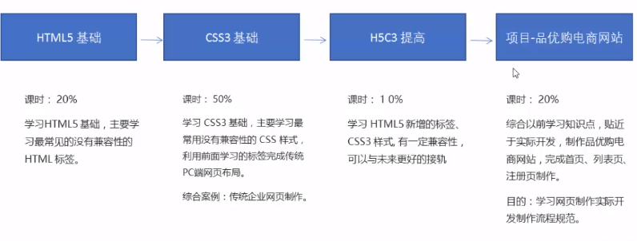

## 1.HTML基础

- 网站是指因特网上根据一定的规则，使用HTML等制作的特定内容的网页集合
- 网页是网站中的一“页”，通常是HTML格式的文件，需要通过浏览器阅读
- 网页是构成网站的基本元素，它通常由图片、链接、文字、声音、视频等元素组成，通常我们看到的网页都是以 .htm 或 .html 后缀结尾，俗称HTML文件

### 1.1 什么是HTML

- HTML是指超文本标记语言（Hyper Text Markup Language），它用来描述网页的一种语言
- HTML 不是一种编程语言，而是一种标记语言 markup language
- 标记语言是一套标记标签 markup tag
- 超文本有2层含义
  - 它可以加入图片、声音、动画、多媒体等内容，超越了文本的限制
  - 它可以从一个文件跳转到另一个文件，与世界各地主机的文件连接（超级链接文本）

### 1.2 常用浏览器

- 浏览器是网页显示和运行的平台

- 常用浏览器如下：

  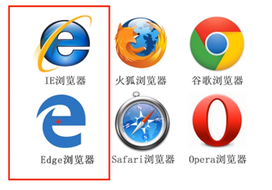

- 浏览器的内核（渲染引擎）：负责读取网页内容，整理讯息，计算网页的显示方式并显示网页

- 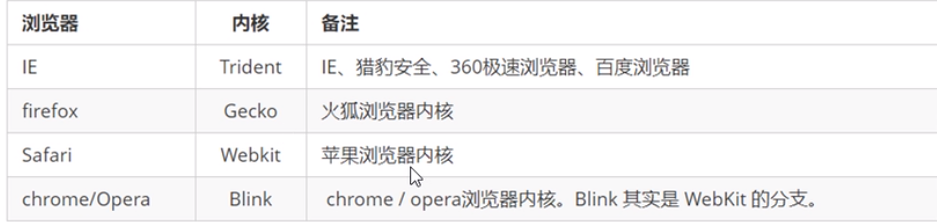

### 1.3 Web 标准

- Web标准是由W3C组织和其他组织标准化组织制定的一系列标准的集合

- Web标准的构成：结构（Structure）、表现（Presentation）、行为（Behavior）三方面

  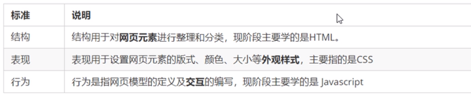

- 结构、表现、行为分离

- 结构写到HTML，表现写到CSS，行为写到JavaScript

### 1.4 HTML标签

- HTML语法规范

  - HTML，必须由尖括号包围，如：<html>

  - 双标签，通常成对出现，如<html> </html>

    - 包含关系

      ```html
      <head>
          <title></title>
      </head> 
      ```

    - 并列关系

      ```html
      <head></head>
      <body></body>
      ```

  - 单标签（极少），如<br />

- HTML 基本结构标签

  - 基本结构标签也称骨架标签

    ```html
    <html>
        <head>
            <title>我的第一个网页</title>
        </head>
        <body>
              好好学习，月薪数万
        </body>
    </html>
    ```

  - 骨架（基本结构）标签

    - < html>< /html>是HTML标签，页面中最大的标签，也称根标签
  
- < head>< /head>是文档的头部，注意在head标签中我们必须设置title标签
  
    - < title> < /title>是文档标题，让每个页面有属于自己的网页标题
    
- < body>< /body>是文档主体，元素包含文档所有内容，页面内容基本放到body里面
  
- 开发工具

- HTML常用标签

    ```html
    <!DOCTYPE html> //表示html5的标签，它是文档声明的标签，不是文档标签
    <html land="en">//zh-CN中文网页，en英文
    <meta charset = "UTF-8">字符集可以通过meta来按照UTF-8来显示
    ```

    - 标题标签< h1>-< h6>，递减，加粗加大

    - 段落标签< p>< /p>，< br/>（break）单标签，强制换行

    - 文本格式化标签：

      - 粗体：< strong>< /strong>（推荐）或者< b>< /b>
      - 斜体：< em>< /em>或者< i>< /i>
      - 删除线：< del>< /del>或< s>< /s>
      - 下划线：< ins>< /ins>或< u>< /u>

    - < div>和< span>标签，没有语义，它们就是盒子，用来布局的;division一人独占一行,span一行可以放多个盒子

      ```html
      <div>这是头部</div>
      <span>今日价格</span>
      ```

    - 图像标签

      - **src**（必须要写的！！！）：< img src="图像URL"/>，属于单标签，src是< img>标签的必须属性，它指定了图像文件的路径和文件名，属性就是图像标签的特性。
      - alt：文本，替换文本，图像无法显示时候的文字
      - title：文本，提示文本，鼠标放到图像上显示的文字
      - width：像素，设置图像的宽度
      - height：像素，设置图像的高度
      - border：像素，设置图像的边框粗细

    - 目录文件夹web后的为根目录存放html，images

    - 路径

      - 相对路径：以引用文件的位置相对于HTML的位置
        - 如果在同一路径只要，“img.jpg”
        - 下一级路径，“images/img.jpg”
        - 上一级路径，“../img.jpg”
      - 绝对路径：本机的绝对地址（很少使用），网络上的绝对地址\

    - 超链接标签：外部链接，内部链接，空链接，下载链接，网页元素链接（点击图片跳转），锚定链接（同一个页面跳转）

      - 外部链接

      - < a href="跳转目标" target="目标窗口的弹出方式" > 文本或图像 < /a>
      - a是anchor，锚
      - href：用于指定链接目标的URL地址
      - target：用于指定链接页面的打开方式，_ self：默认值，_ blank：新窗口打开方式
      - 内部链接写法和jpg类似
      - 空链接：href="#"
      - 锚定链接：href="#two" ，对应目标位置id="two"
      - 

- HTML中的注释和特殊字符

    - ```html
      <!--我想喝咖啡 --> //注释标签  快捷键:ctrl + /
      ```

    - 特殊字符

      - 空格：& nbsp;
      - 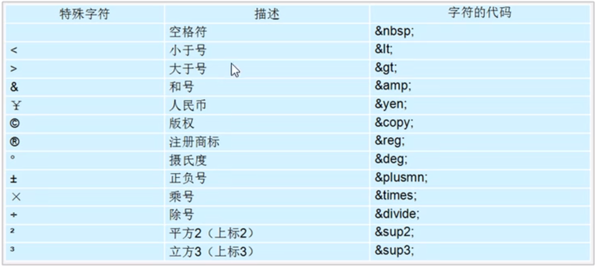
      - 空格，大于号，小于号常用

## 2.HTML标签

### 2.1 表格

- 表格标签

  - 作用：显示、展示**数据**

  - ```html
    <table> //定义表格的标签
        <tr>
            <td>单元格内的文字</td>//单元格必须在<tr></tr>里面
            ...                  //tb是table data，即数据单元格                               //的内容
        </tr> //定义表格中的行，必须嵌套在<table></table>里面
    </table>
    ```

  - 表头单元格标签 < th>姓名< /th>

  - 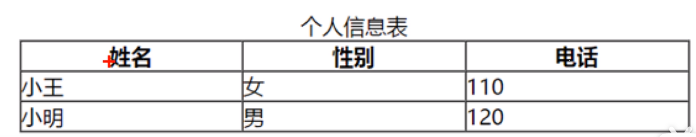

  - 表格标签的属性这块，一般通过CSS来实现

  - 属性都要写到< table>里面去

  - 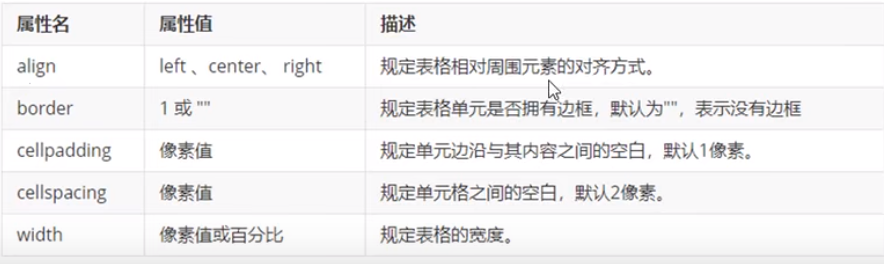

  - < thead>标签：表格的头部区域

  - 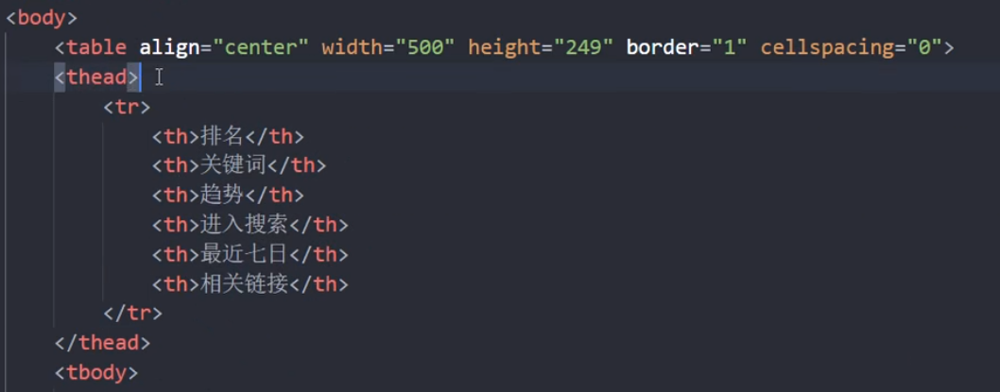

  - < tbody>标签：表格的主体区域

  - 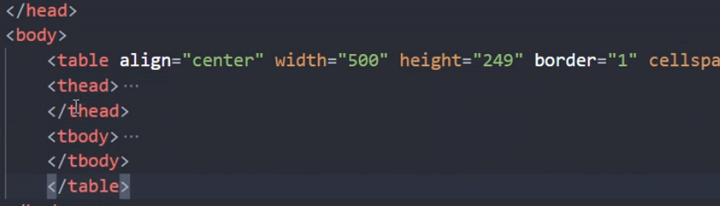

  - 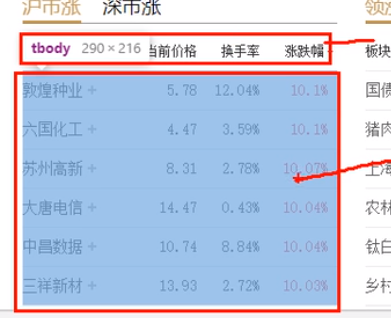

- 合并单元格

  - 跨行合并：rowspan="合并单元格的个数"

  - 跨列合并：colspan="合并单元格的个数"

  - 目标单元格（写合并代码）

  - 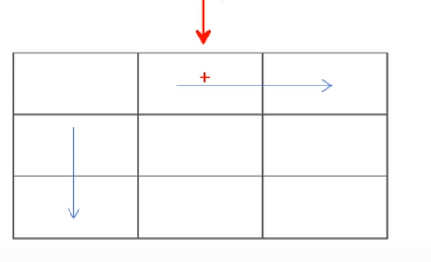

  - 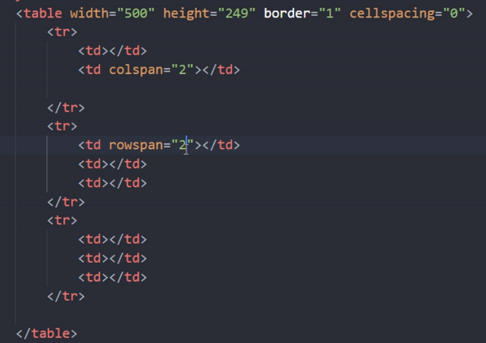

    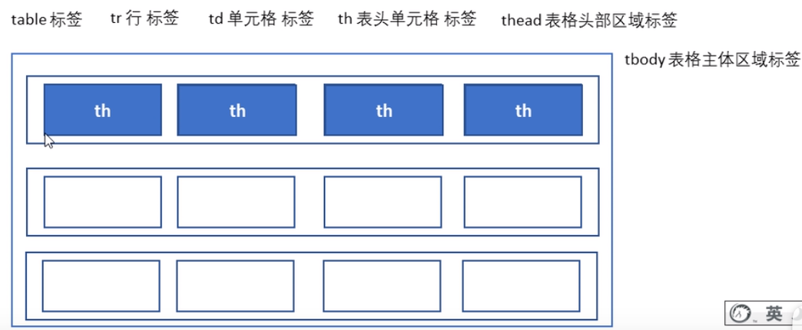

    

- 综合案例

  - 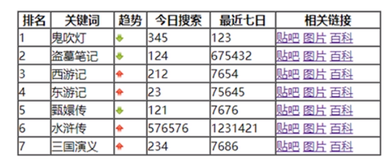

### 2.2 无序列表

- 列表标签
  - 列表的作用：用来布局
  - 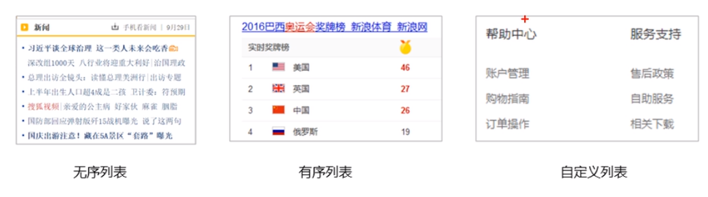

- **无序列表**（重点）

  - ```html
    <ul>
        <li>列表项1</li>
        <li>列表项2</li>
        <li>列表项3</li>
        ...
    </ul>
    ```

  - 没有顺序区别，无序的

  - < ul>只能放< li>,< li>可以放其他< p>

- 有序列表（理解）

  - ```html
    <ol>
        <li>列表项1</li>
        <li>列表项2</li>
        <li>列表项3</li》
    </ol>
    ```

  - < ol>只能放< li>,< li>可以放其他< p>

- **自定义列表**（重点）

  - 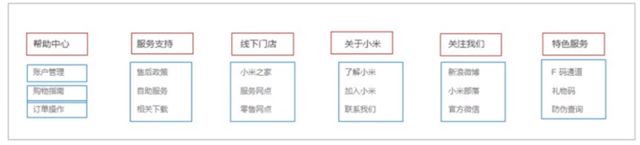

  - ```html
    <dl>
        <dt>关注我们</dt>
        <dd>新浪微博</dd>
        <dd>官方微信</dd>
        <dd>联系我们</dd>
    </dl>
    ```

  - < dl>只能放< dt>和< dd>，< dd>和< dt>可以放任何标签

### 2.3 常用input表单

- 表单标签

  - 收集用户信息：表单域，表单控件（表单信息），提示信息

  - 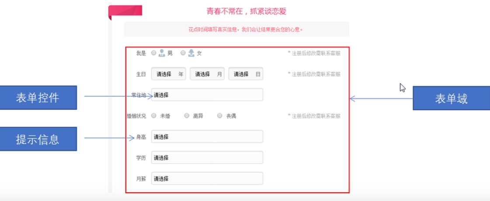

  - 表单域

    - ```html
      <form action="url地址" method="提交方式" name="表单域名称"> 各种表单元素控件
      </form>
      ```

    - action：url地址，用于指定接受并处理表达的URL地址

    - method：get/post，用于设置表单数据的提交方式，其取值为get或post

    - name：名称，用于指定表单的名称，以区分同一个页面中的不同表单域

- < input type="属性值" />

  - < input />为单标签，type属性设置不同的属性值指定不同的控件类型

  - 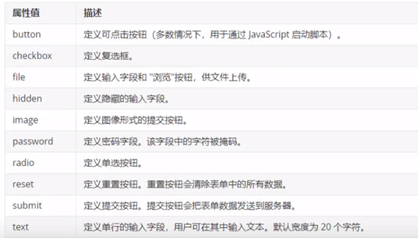

  - radio虽然是单选按钮，实际行可以实现多选，只有性别单选按钮有相同的姓名name才能实现多选一

  - ```html
    性别：男<input type="radio" name="sex"> 
         女<input type="radio" name="sex"> <br>
    ```
    
  - 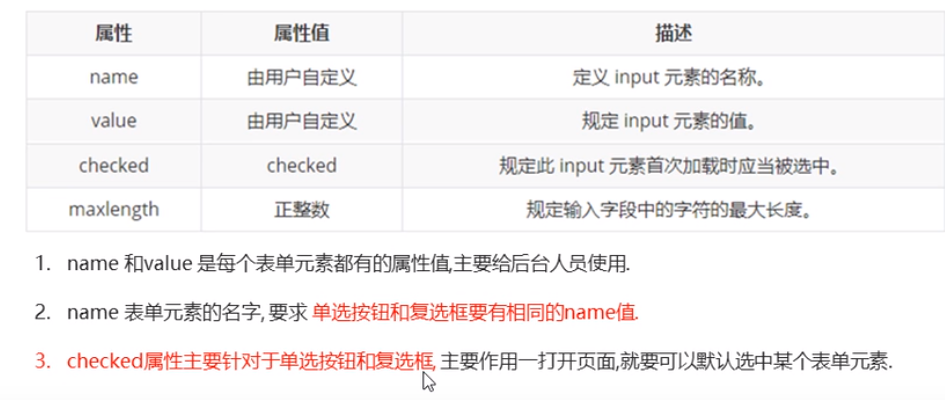
  
  - < label>为input元素定义的标注标签，自动光标对准
  
  - ```html
    <label for="sex">男</label>
    <input type="radio" name="sex" id="sex" >
    ```

### 2.5 下拉列表表单

- select 下拉表单元素

  - 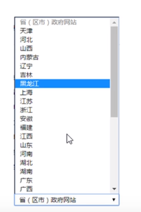

  - ```html
    <select>
        <option>选项1</option>
        <option>选项2</option>
        <option>选项3</option>
        <option>选项4</option>
    </select>
    ```

- textarea 文本域元素

  - 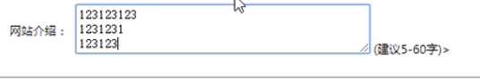

  - ```html
    <textarea rows="3" cols="20">
    文本内容
    </textarea>
    ```

### 2.6 表单元素实现注册页面

- 表格标签
- 列表标签
- 表单标签
- 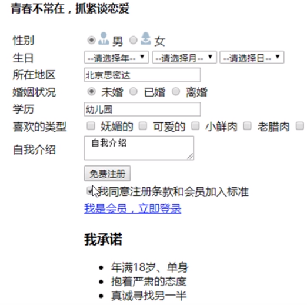
- < tr>表示行，< td>表示行里面的单元格

### 2.7 查询W3C文档

## 3.CSS层叠样式

- CSS基础选择器
- 字体样式
- 文本样式
- CSS的三种引入方式
- Chrome 工具调试样式

## 4.CSS

## 5.CSS三大特性

## 6.综合案例

## 7.常见图片格式

## 8.定位

## 9.CSS高级技巧

## 10.HTML5和CSS3提高

 