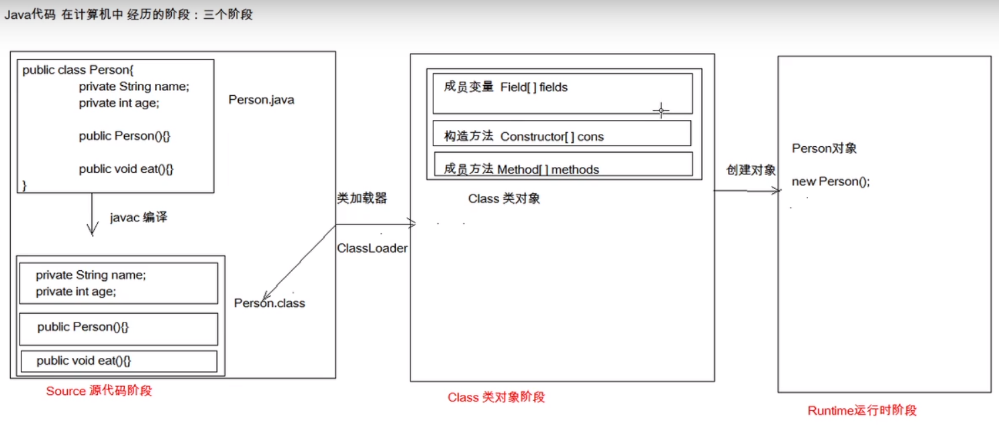

[TOC]

# Junit单元测试

## 一、测试分类

### 1.1黑盒测试

- 只知道input和output

### 1.2白盒测试

- Junit测试是白盒测试的一种，知道具体测试的流程

## 二、Junit使用

- 定义一个测试类（测试用例）
  - 类名Test，CalculatorTest
  - 包名,XXX.XXX.XX.test
  - 测试方法
  - 加注解
- 导入Junit依赖
- 判定结果
  - 红色：失败
  - 绿色：成功
- 断言结果

## 三、反射

- 反射：框架设计的灵魂
- 框架：半成品，可以在框架的基础上进行软件开发，简化编程
- 反射：将类的各个组成部分封装成其他对象，这就是反射机制
- 
- 反射的好处：
  - 可以在程序运行过程中，操作对象
  - 可以解耦，扩展程序的可拓展性
- 获取Class对象的方式
  - Class.forName("全类名")：将字节码文件加载进内存，返回class对象
  - 类名.class：通过类名的属性class获取
  - 对象.getclass()：getclass(）在object类中定义
- 空构造：需要一个无参的构造器来生成对象。
- 重点！同一个字节码文件(*.class) 在一次程序运行过程中，只会被加载一次，无论通过哪种方式获得的class对象都是同一个
- 使用class对象

## 四、注解

- 配置文件：需要创建的对象的全类名和需要执行的方法定义
- 在程序中加载读取配置文件
- 使用反射技术加载类文件进内存
- 执行方法
- 元注解：描述注解的注解
- 解析注解
- 注解就是程序的标签，不是程序的一部分